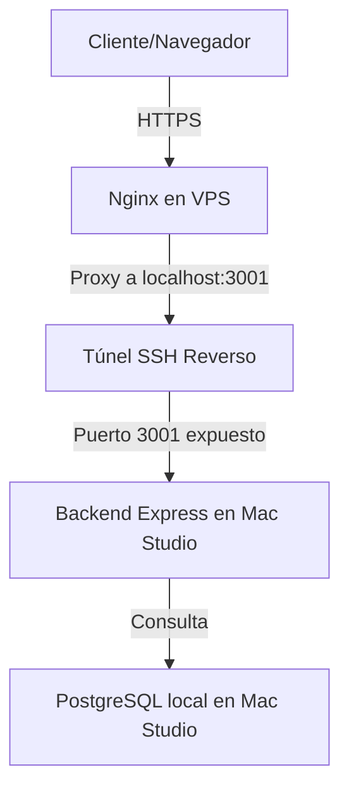

# Skill: Arquitectura de Túnel Reverso y PDFs en Base de Datos

Esta skill describe los principios, la arquitectura y el flujo de trabajo para servir la aplicación **Epicrisis AI** utilizando la Mac Studio local como servidor de datos y backend, y el VPS de Hostinger como pasarela pública y SSL. También detalla el esquema para almacenar PDFs de forma consistente dentro de la base de datos PostgreSQL.

---

## 1. Arquitectura de Red (Túnel Reverso)

Para evitar exponer puertos directamente a internet y no depender de servicios como Ngrok, se utiliza un túnel SSH reverso persistente desde la Mac Studio local hacia el VPS de Hostinger:



### Comandos de Configuración

1. **Abrir el túnel desde la Mac Studio:**
   ```bash
   ssh -N -R 3001:localhost:3001 root@2.24.69.49
   ```
   * `-N`: No ejecuta comandos remotos (solo establece el túnel).
   * `-R 3001:localhost:3001`: Mapea el puerto `3001` del VPS al puerto `3001` de tu Mac Studio.

2. **Nginx en el VPS:**
   Redirecciona el tráfico de `https://epicrisis.2.24.69.49.nip.io` a `http://127.0.0.1:3001`. El tráfico viaja seguro a través de la encriptación de SSH directamente a tu máquina local.

---

## 2. PDFs en Base de Datos (Consistencia de Datos)

En lugar de almacenar los archivos PDF en el disco como archivos sueltos (lo que genera problemas de sincronización, permisos y rutas relativas), los PDFs se almacenan como binarios en una columna de tipo `bytea` en PostgreSQL.

### Ventajas:
* **Portabilidad:** Un solo `pg_dump` respalda toda la información clínica y los documentos PDF.
* **Integridad referencial:** Es imposible borrar un PDF sin borrar su epicrisis asociada.
* **Sin sincronización:** No es necesario copiar archivos por `scp` al VPS o a otras máquinas.

### Esquema de la Tabla (`db/schema.ts`):
```typescript
import { pgTable, text, customType } from 'drizzle-orm/pg-core';

// Representación de buffer binario para guardar el PDF
const bytea = customType<{ data: Buffer }>({
  dataType() {
    return 'bytea';
  },
});

export const epicrisis = pgTable('epicrisis', {
  patientId: text('patient_id').primaryKey(),
  // ... otros campos clínicos
  pdfData: bytea('pdf_data'), // Columna binaria para almacenar el PDF completo
  status: text('status').default('pending'),
});
```

---

## 3. Integración con la Pipeline de Extracción

Cuando la pipeline local en `/Users/fabianortega/src/proyecto_sotero_ihealth/pipeline` procesa una epicrisis:
1. Extrae los textos y calcula el hash del RUT/Paciente para generar el `patientId` (ej. `87F9EEF0DAA7B91C`).
2. Lee el archivo PDF original de forma binaria.
3. Inserta todos los datos en la base de datos PostgreSQL local, incluyendo el binario del PDF en la columna `pdf_data`.
4. El backend Express sirve el PDF directamente desde la base de datos a través de una ruta simple:
   ```typescript
   app.get('/api/pdf', async (req, res) => {
     const { id } = req.query;
     const doc = await db.select().from(epicrisis).where(eq(epicrisis.patientId, id)).limit(1);
     if (!doc[0] || !doc[0].pdfData) return res.status(404).send('PDF no encontrado');
     res.setHeader('Content-Type', 'application/pdf');
     res.send(doc[0].pdfData);
   });
   ```
